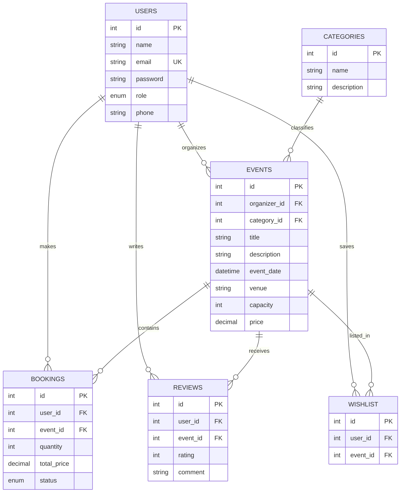

# 📊 Database ER Diagram

Below is the visual representation of the EthioEvent Hub database schema.

```mermaid
erDiagram
    USERS ||--o{ EVENTS : organizes
    USERS ||--o{ BOOKINGS : makes
    USERS ||--o{ REVIEWS : writes
    USERS ||--o{ WISHLIST : saves
    CATEGORIES ||--o{ EVENTS : classifies
    EVENTS ||--o{ BOOKINGS : contains
    EVENTS ||--o{ REVIEWS : receives
    EVENTS ||--o{ WISHLIST : listed_in

    USERS {
        int id PK
        string name
        string email UK
        string password
        enum role
        string phone
    }

    CATEGORIES {
        int id PK
        string name
        string description
    }

    EVENTS {
        int id PK
        int organizer_id FK
        int category_id FK
        string title
        string description
        datetime event_date
        string venue
        int capacity
        decimal price
    }

    BOOKINGS {
        int id PK
        int user_id FK
        int event_id FK
        int quantity
        decimal total_price
        enum status
    }

    REVIEWS {
        int id PK
        int user_id FK
        int event_id FK
        int rating
        string comment
    }

    WISHLIST {
        int id PK
        int user_id FK
        int event_id FK
    }
```

---
*© 2026 EthioEvent Hub Team*
